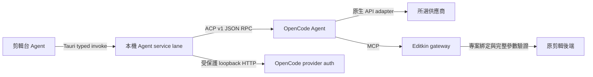

# Agent 供應商與剪輯協定（round56–59）

round59 預設入口直接開啟內部對話，外部 AI 工作階段收進進階選項；固定規則與原 Kit 任務索引由程式供應，不再逐次重送外部啟動指令。共用來源、舊 session 相容、參數更正提示及驗證邊界見 [內部任務交接](INTERNAL_AGENT_HANDOFF.md)。

round58 使用者確認改為先選供應商／來源，再選模型。主介面八個大項：本機、OpenAI／Codex、Claude、Gemini、Grok、OpenRouter、DeepSeek、OmniRoute；第二層只列選定來源模型。未設定／無模型／未支援來源有提示及設定入口，不會默默切回上一個模型；完成設定與模型刷新後需明確選擇模型。Login 與 API key 只在 ⋯ →「模型供應商設定」。真實帳號可用性仍需實際回合核對。

round57新增OmniRoute外接閘道。所有來源維持同一Agent視窗／對話／模型選單／剪輯工具；動態route與deploy/account界限見`OMNIROUTE_INTEGRATION.md`。原生六家直接API／ChatGPT device登入繼續沿下列協定，沒有把外部閘道管理登入替換成另一個剪輯對話。

使用者目前要求先完成多供應商 API、ChatGPT 登入及 Agent／剪輯台協定；客製功能後續加入。改動先在本機 Git 保留，等使用者明確說告一段落才整理提交原作者 GitHub repo。現在沒有上游 push／PR。

## 供應商與登入

支援原本的本機／區網來源，另開放 OpenAI、Anthropic、Google Gemini、OpenRouter、xAI、DeepSeek 的原生 OpenCode API adapters。模型 ID 來自真正 ACP config options， UI／Node／Tauri 恢復對話共同允許這些來源；未知 ID 不可繞過模型選單或原 MCP 後端驗證。

Agent 右上 ⋯ →「模型供應商設定」提供供應商選擇、遮罩 API 金鑰、儲存／移除及更新模型清單。API 金鑰只送進本機服務的原生 Auth API，沒有放進 prompt、專案或封裝 CAS；表單送出／換供應商會清空。憑證由本機 OpenCode 共用管理，介面明示替換／移除也會影響其他 OpenCode 使用；沒有讀取或搬運其他產品的 token 檔案。

OpenAI「Continue with ChatGPT」使用封裝內 OpenCode 提供的 headless/device 授權方式，在系統瀏覽器完成授權並顯示原生裝置碼指示。選用裝置流程的原因是 browser callback 方法在 Windows 留下 FirewallControlPanel 通知；沒有修改防火牆規則。API 金鑰與帳號方案是不同使用／計費方式，模型目錄或「已有設定」不證明登入帳號有某模型的額度。

官方產品參考：[OpenAI 登入與方案使用](https://developers.openai.com/siwc/quickstart)、[模型與 inference](https://developers.openai.com/siwc/token-sharing-open-source/models-and-inference)、[OpenCode providers](https://opencode.ai/docs/providers/)。本輪重用封裝內的原生 OpenCode auth／provider 行為，沒有建立自己的 OAuth client、抄用 Codex token 或新加第三方 SDK。OpenAI 官方新的 OSS Sign in with ChatGPT flow 是另外的整合契約，不能把原生 OpenCode auth 入口的有限驗收宣稱為該新 flow 的全套 attestation。

## 通訊與生命週期

- 對話沿原 `initialize`／`session/new`／`session/load`／`session/prompt`、config、permission、cancel、turn 事件；模型來源改變不新增另一套剪輯執行器。工具狀態與 projectChanged 仍由真正回覆與原專案 fingerprint 決定。
- `agent_provider_action` 是同一個 Agent resident lane 中的獨立控制 request，有既有 request IDs／bounded queues，native timeout 60 秒。controller 啟動 20 秒、一般原生 HTTP 15 秒；登入 callback 在背景等待至多十分鐘，不阻塞 resident RPC。
- 供應商設定 server 只綁 127.0.0.1、隨機 port，使用每次隨機產生且只留 Node 記憶體的 Basic credential；只有一個 owned child。無登入時 idle 60 秒會退出，等待登入最多十分鐘，服務結束會關閉 child。stderr／原生 HTTP error body 不轉到 UI。server password／access token 不進 renderer，授權 URL 由 Tauri 驗 host 後交給系統瀏覽器，不進 renderer／log。
- 登入每次使用 opaque attempt ID；native method index 來自原生 metadata，不以顯示順序猜測。取消會 abort callback、關閉 owned provider child；遲到回覆不能把已取消 attempt 改成完成，不停止 ACP 剪輯 session。
- 憑證變更增加配置版本。ACP 重啟只承認啟動前取得且啟動後仍相同的版本；新版本未刷新時 UI 與 backend 都阻擋新 prompt。已進行的回合繼續完成，登入不能使舊回合結果落到新專案。
- 剪輯仍用完整 `arguments.projectPath`／`commands`、原 commands schema 及固定送出時的字幕／片段目標。成功修改一次、Undo、專案重載與原 Kit 證據保留仍沿原路徑；API 失敗不自動重送不確定的 apply／render。

## 驗證範圍

40 項相關 TypeScript 測試涵蓋模型來源、原 ACP／字幕／專案邊界、credential metadata redaction、Auth API envelope、壞 key／host／stale attempt 拒絕、取消後遲到回覆及配置版本承認。原 resident lane policy 加入供應商控制，完整封裝的實際 Tauri invoke／HTTP auth／ACP／MCP 路徑驗收另存 artifacts。

封裝版的供應商與登入流程仍需在隔離環境重測；來源測試只覆蓋設定與資料契約，未證明真實帳號額度、登入資格或付費模型推論。

真實帳號登入後的方案額度、token renewal、各家付費 API 的實際成功回合尚需使用者在 EXE 內完成設定後驗證。不要在 chat 要求貼 API key／token，也不能把 catalog／登入控制測試当成模型 entitlement 證明。後续優先帳號實測、额度／401／429／刷新失效顯示與更多供應商協定反例；原正式作品與歷史保留上限仍未完成。
