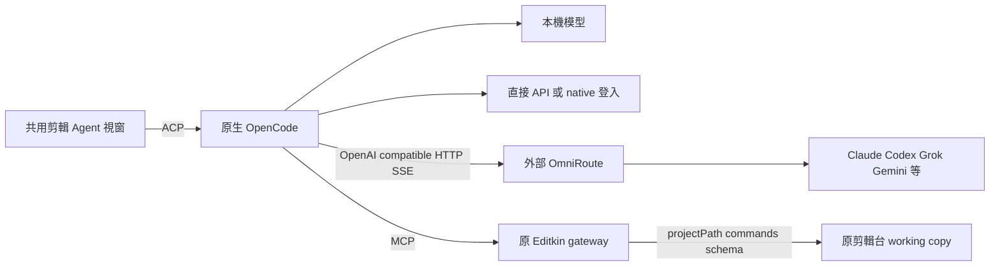

# OmniRoute 與共用 Agent（round57）

使用者要求本機、API、登入都使用同一個 Agent 視窗，評估 OmniRoute 並接入 Claude、Codex、Grok、Gemini 等來源。所有修改先留本機，告一段落後回報，提交原作者 GitHub 仍等使用者決定。

## 整合判斷與部署條件

OmniRoute 適合作為外接模型閘道。其原生 OpenCode 接線也是 `@ai-sdk/openai-compatible`，提供 `/v1/models` 和 `/v1/chat/completions`；不需要另一套剪輯 Agent 或安裝新的 Editkin SDK 依賴。此輪沒有複製 OmniRoute 程式碼或 bundling 它的服務。

研究固定在 `diegosouzapw/OmniRoute` commit `0b62441dbcc3f86a1844a77558733b806537e688`（release/v3.8.52）。[OpenCode 接線原始碼](https://github.com/diegosouzapw/OmniRoute/blob/0b62441dbcc3f86a1844a77558733b806537e688/src/shared/services/opencodeConfig.ts)、[OpenCode 文件](https://github.com/diegosouzapw/OmniRoute/blob/0b62441dbcc3f86a1844a77558733b806537e688/docs/frameworks/OPENCODE.md)、[provider 參考](https://github.com/diegosouzapw/OmniRoute/blob/0b62441dbcc3f86a1844a77558733b806537e688/docs/reference/PROVIDER_REFERENCE.md)。文件部分日期與版本不一致，模型與傳輸採固定原始碼及真正 native runtime 為準。

本機沒有 OmniRoute 命令或20128 listener。調查時 npm 可取得3.8.51（unpacked 546,111,751 bytes），Git3.8.52 尚無對應 npm release（404）；其 engine 是 Node `>=22.22.2 <23 || >=24.0.0 <27`，目前本機22.16.0不符合。沒有全域升級 Node、安裝半GB閘道或留下持久服務。EXE的本輪功能是接上**已啟動的 OmniRoute**；實際部署／登入／額度仍需另驗，不能把 adapter fixture 當作真正 OmniRoute server 已安裝。

## 共用視窗與設定

本機、六家直接 API／原生 ChatGPT 登入、OmniRoute 都使用原 `OpenCodeAgentDock` 的輸入框、對話紀錄、選取引用、模型選单與 MCP 剪輯工具。來源標示出現在同一模型選單。切換模型仍受 busy／permission／專案／schema 邊界；沒有另開 Claude、Codex、Grok 或 Gemini 剪輯對話。

Agent ⋯ →「模型供應商設定」→ OmniRoute：

1. 先啟動自己的 OmniRoute，輸入位址（預設 `http://127.0.0.1:20128`）。可輸入 baseURL 或帶一次 `/v1`；reverse proxy prefix 保留。
2. 「管理 OmniRoute API／登入」在系統瀏覽器打開該閘道的 `/dashboard/providers`。可在模型尚未設定時打開；此 EXE 不代管各家 OAuth，也不自動匯入其他產品 token 檔案。
3. 若閘道啟用 API key，填閘道金鑰，按「連線並讀取工具模型」。key只走 native OpenCode Auth API；沒有写進 endpoint URL、app metadata、專案、prompt或封裝。
4. 按「更新模型清單」，再在原模型選單選路由。原 session與 working copy續接，刷新前UI/backend拒絕新prompt。
5. 「清除剪輯台閘道設定」可移除正常或壞掉的 app metadata，保留 OpenCode 共用憑證；再刷新模型。不会停止外部OmniRoute服務。

各家可用API／登入方法由實際OmniRoute部署與帳號決定。[Codex app-server](https://github.com/diegosouzapw/OmniRoute/blob/0b62441dbcc3f86a1844a77558733b806537e688/docs/guides/CODEX-APP-SERVER-PROVIDER.md)與直接token代理是不同路徑，不能把任一catalog entry當成所有訂閱皆可用。未取得真實Claude、Codex、Grok、Gemini帳號推論證據。

## 通訊契約

`connect-gateway`先驗URL與完整catalog，再更新app-owned metadata；catalog失敗不更換原連線。HTTP只允許loopback／私有IPv4或HTTPS，拒絕URL credentials、query/hash、控制字元、重複/v1。15秒fetch、拒絕redirect、最多8MiB response／4096catalog項目／2048工具模型。HTTP error body不顯示；401／429不自動重送剪輯。

只有明確 `capabilities.tool_calling === true` 的模型進入剪輯清單，缺值或false排除；同一ID的矛盾metadata也保守排除。這是catalog能力門檻，不是真實模型能力或額度證明。route ID完整保留，如`omniroute/cc/<model>`；不丟掉cc／cx／gc／gemini等前綴，不靠硬編碼的熱門模型猜測。未知模型仍受native options及原schema驗證。

`agent-providers/omniroute.opencode.json`只有OpenCode provider metadata（baseURL、模型ID和有限context/output），無key/token。ACP與provider設定server都用同一檔；以原生`OPENCODE_CONFIG`路徑傳遞，避免Windows長environment value限制。原本local provider config content繼續使用，其他provider credentials由原生OpenCode管理。写檔限定由Tauri產生的app-data路徑，regular parent/file，atomic temporary/rename，拒絕auth-bearing文件、symlink與越界路徑。

設定變動採round56配置版本契約；原生ACP重啟前後版本相同才承認刷新。若刷新期间再次變更，UI不能誤顯示成功。開管理頁的URL由Tauri驗HTTP(S)、host、無userinfo/query/hash及dashboard path後交系統瀏覽器，URL不經renderer回覆；只打開管理頁不啟動child。

## 驗收界限

聚焦測試涵蓋exact route IDs、來源標示、URL/key/scheme限制、capability排除、shared native auth envelope、無key的metadata、HTTP401/429與超大body、失敗保存原config、corrupt metadata清理、版本刷新門檻。

`review-agent-caption-selection.mjs --omniroute`使用明示隔離OpenAI格式fixture。在真正封裝Tauri／native OpenCode／ACP／MCP中，透過設定UI連線、讀四個工具模型、同一session／同一輸入框切換四個route並回覆、然後實際單次修改字幕／Undo／同步／取消引用／cloud resume。登入沿真正native ChatGPT device start/cancel，未完成帳號授權。沒有安裝真正OmniRoute或付費模型推論，測試不消耗各家的帳號額度。

工程驗收、EXE hash、cache／程序清理、還原點與本輪實際report名稱以工作區本輪handoff／acceptance為準。後續只有使用者提供可運作的OmniRoute部署並在產品內完成帳號設定後，才驗證真實gateway路由、各家額度、登入刷新及實際剪輯能力。提交仍等使用者決定。
